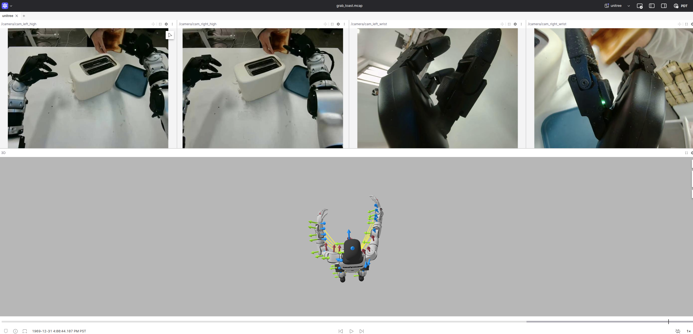
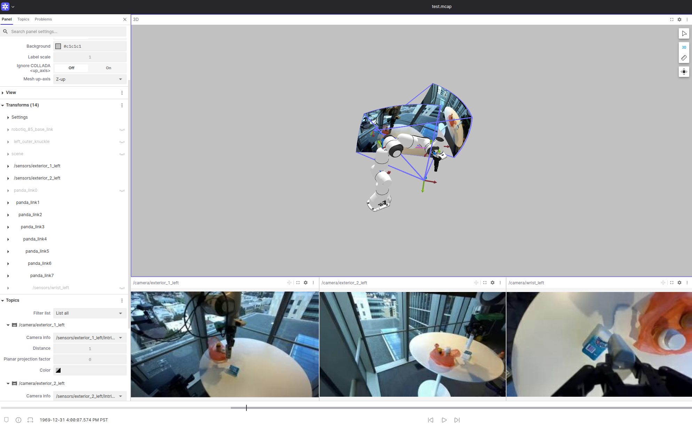
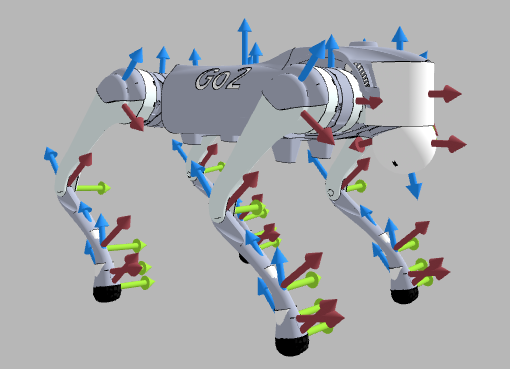
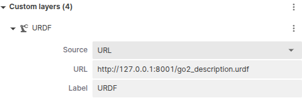

# embodi-vis

## 1. About this repository

This repository provides scripts to convert open-source robotics datasets (e.g., LeRobot, DROID, EmbodiedScan, Open X-Embodiment) into MCAP files for visualization on the [Foxglove](https://app.foxglove.dev/) platform. 


## 2. Environment
You can create a conda env from the [yaml](./environment.yml) file.  
```sh
conda env create -f environment.yml
```

Please be aware of unresolved dependency conflicts between `lerobot`, `urdfpy`, `networkx`, and `numpy`. This may require manual code modifications in your local environment. Specifically, deprecated NumPy constants (`np.float`, `np.int`, `np.infty`) may need to be replaced in the `urdfpy` and `pyrender` source code within your `site-packages` directory.

## 3. Dataset
You can use the provided scripts and pointers to download the datasets.   


### 3.1 Lerobot
The script expects the datasets to be as the following:
```sh
$ tree -L 3 .
.
├── ...
├── lerobot
│   └── droid_1.0.1
│       ├── data
│       ├── meta
│       └── videos
└── unitreerobotics
│   └── G1_Dex3_ToastedBread_Dataset
│       ├── data
│       ├── meta
│       └── videos
└── urdf
    ├── droid.urdf
    ├── g1_29dof_rev_1_0.urdf
    └── meshes
        ├── head_link.STL
        ├── left_ankle_pitch_link.STL
        ├── left_ankle_roll_link.STL
        │── ...
```

The LeRobot datasets will be automatically downloaded by the `LeRobotDataset` API from huggingface  
- [droid_1.0.1](https://huggingface.co/datasets/lerobot/droid_1.0.1)
- [G1_Dex3_ToastedBread_Dataset](https://huggingface.co/datasets/unitreerobotics/G1_Dex3_ToastedBread_Dataset)

The visualization scripts are expected to be compatible with other datasets from the [unitreerobotics](https://huggingface.co/unitreerobotics) project, although they have not been formally tested.

### 3.2 Droid


### 3.3 EmbodiedScan
Coming soon

### 3.4 Open X-Embodiment
Coming soon


## 4. Visualization Scripts
Inspired by the [nuscenes2mcap](https://github.com/foxglove/nuscenes2mcap) repository, we provide example Python scripts to convert datasets from their original format to MCAP files.  

Before running the visualization scripts, please ensure the datasets are present, as described in Section 3.

### 4.1 Lerobot 
For the unitree dataset, run
```sh
python ./convert_unitree_g1_to_mcap.py
```



For the DROID dataset (in LeRobot format, not the original DROID release), run:
```sh
python ./convert_droid_101_to_mcap.py
```



### 4.2 Unitree go2
We recorded a go2 robot "standing" experiment in `go2_motor_states.csv`. The recording consists of 12 columns corresponding to the 12 actuated joint states.
```sh
python ./convert_unitree_go2_to_mcap.py
```



### 4.2 Droid


### 4.3 EmbodiedScan
Coming soon

### 4.4 Open X-Embodiment
Coming soon


## 5 Serve the urdf files
You need to serve the urdf files for the foxglove frontend. 

```sh
npx http-server ./urdf -p 8001 --cors
```
Then via the frontend, you can add a URDF layer in the 3D panel using the provided urdf files in the repository


