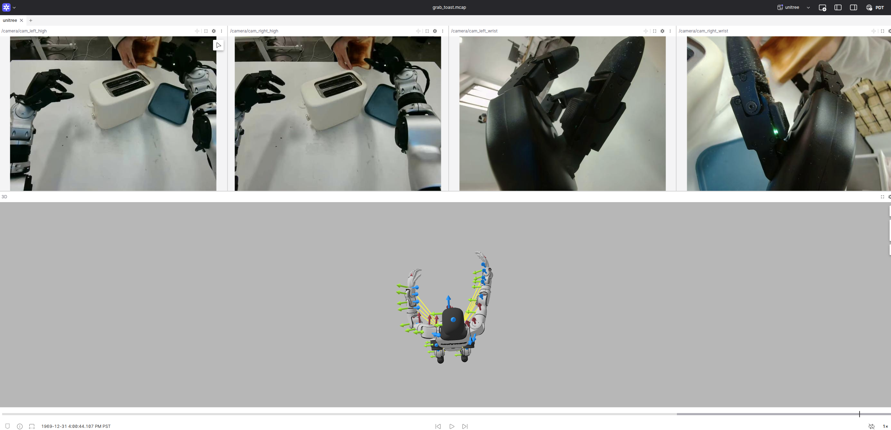

# embodi-vis

## 1. About this repository

This repository contains scripts to convert open robotics dataset (Lerobot, Droid, EmbodiedScan, Open X-Embodiment etc.) to mcap files that can be visualized on https://app.foxglove.dev/. 


## 2. Environment
You can create a conda env from the [yaml](./environment.yml) file.  
```sh
conda env create -f environment.yml
```

Notice that there is a [dependency hell](https://en.wikipedia.org/wiki/Dependency_hell) which I have not resolved. The hell is created by lerobot, urdfpy, networkx and numpy. You need to touch some code involving `np.float, np.int, np.infty` in the urdfpy and pyrender source code in `site_packages`/

## 3. Dataset
You can use the scripts and pointers to download the datasets.   


### 3.1 Lerobot


### 3.2 Droid


### 3.3 EmbodiedScan
Coming soon

### 3.4 Open X-Embodiment
Coming soon


## 4 Visualization scirpts
Inspired by [nuscenes2mcap](https://github.com/foxglove/nuscenes2mcap) repository, here we provide example python scripts to convert dataset in its original format to mcap files. 

### 4.1 Lerobot 
The script expects the datasets to be as the following:
```sh
$ tree -L 3 .
.
├── ...
├── lerobot
│   └── droid_1.0.1
│       ├── data
│       ├── meta
│       └── videos
└── unitreerobotics
│   └── G1_Dex3_ToastedBread_Dataset
│       ├── data
│       ├── meta
│       └── videos
└── urdf
    ├── droid.urdf
    ├── g1_29dof_rev_1_0.urdf
    └── meshes
        ├── head_link.STL
        ├── left_ankle_pitch_link.STL
        ├── left_ankle_roll_link.STL
```

For the unitree dataset, run
```sh
python ./convert_unitree_to_mcap.py
```



For the droid dataset (in lerobot format, not the original droid release), run
```sh
python ./convert_droid_101_to_mcap.py
```


### 4.2 Droid


### 4.3 EmbodiedScan
Coming soon

### 4.4 Open X-Embodiment
Coming soon
