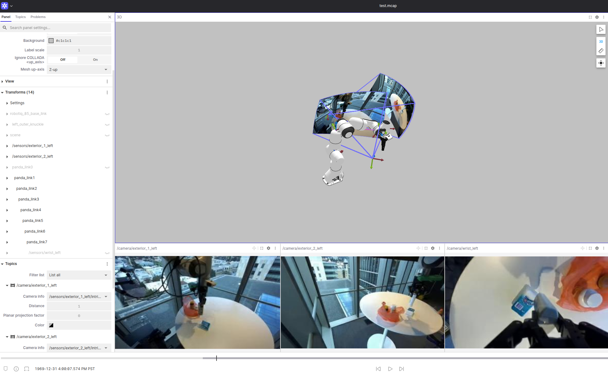
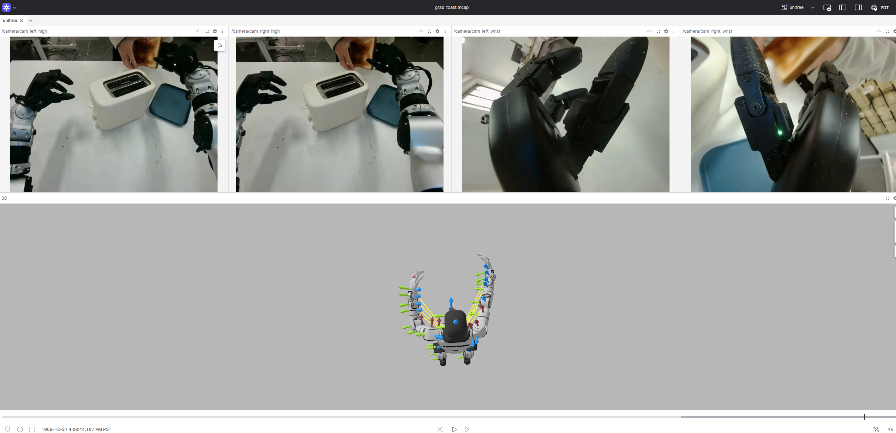
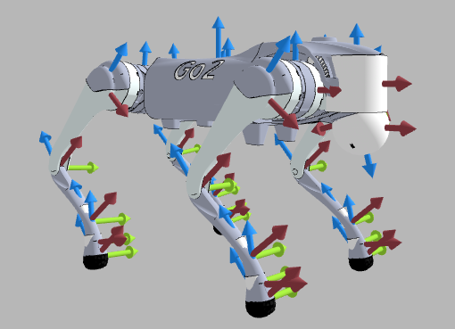
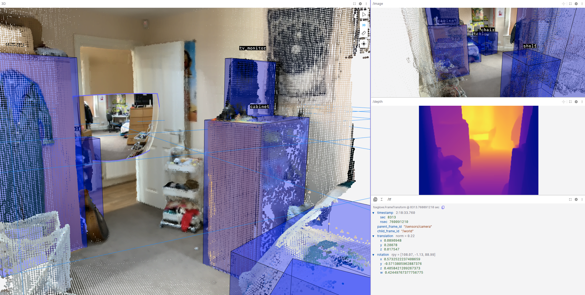
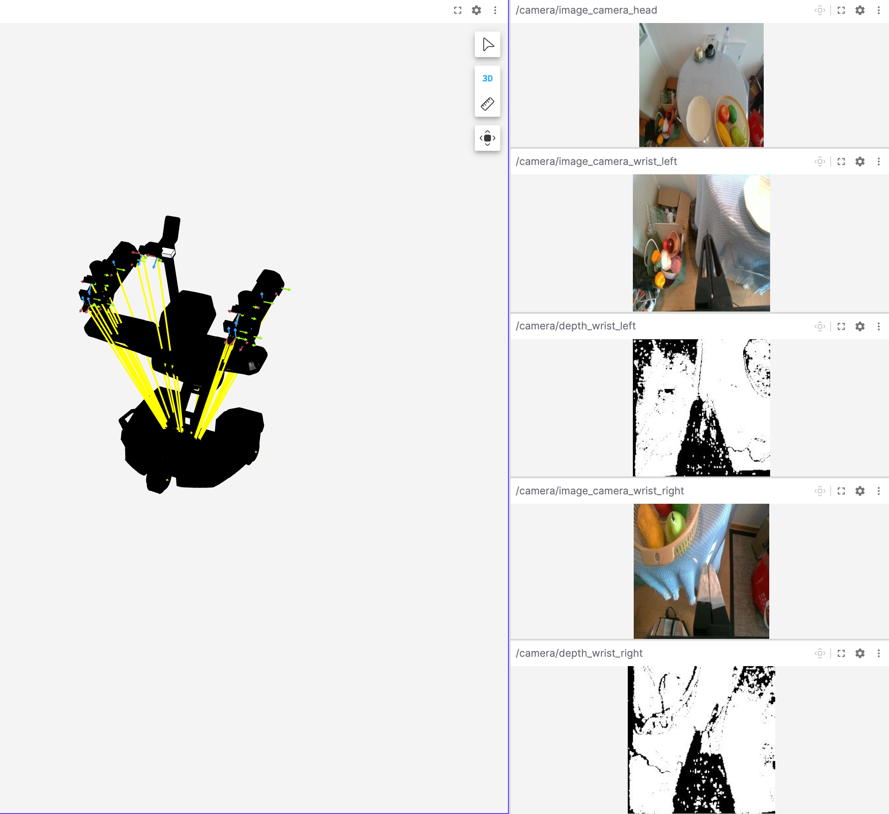
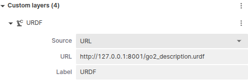

# embodi-vis

## 1. About this repository

This repository provides scripts to convert open-source robotics datasets (e.g., LeRobot, DROID, EmbodiedScan, Open X-Embodiment) into MCAP files for visualization on the [Foxglove](https://app.foxglove.dev/) platform. 


## 2. Environment
You can create a conda env from the [yaml](./environment.yml) file.  
```sh
conda env create -f environment.yml
```

Please be aware of unresolved dependency conflicts between `lerobot`, `urdfpy`, `networkx`, and `numpy`. This may require manual code modifications in your local environment. Specifically, deprecated NumPy constants (`np.float`, `np.int`, `np.infty`) may need to be replaced in the `urdfpy` and `pyrender` source code within your `site-packages` directory.

## 3. Dataset
You can use the provided scripts and pointers to download the datasets.   


### 3.1 Droid
#### 3.1.1 Lerobot format
The script expects the datasets to be as the following:
```sh
$ tree -L 3 .
.
├── ...
├── lerobot
│   └── droid_1.0.1
│       ├── data
│       ├── meta
│       └── videos
└── unitreerobotics
│   └── G1_Dex3_ToastedBread_Dataset
│       ├── data
│       ├── meta
│       └── videos
└── urdf
    ├── droid.urdf
    ├── g1_29dof_rev_1_0.urdf
    └── meshes
        ├── head_link.STL
        ├── left_ankle_pitch_link.STL
        ├── left_ankle_roll_link.STL
        │── ...
```

The LeRobot datasets will be automatically downloaded by the `LeRobotDataset` API from huggingface  
- [droid_1.0.1](https://huggingface.co/datasets/lerobot/droid_1.0.1)
- [G1_Dex3_ToastedBread_Dataset](https://huggingface.co/datasets/unitreerobotics/G1_Dex3_ToastedBread_Dataset)

The visualization scripts are expected to be compatible with other datasets from the [unitreerobotics](https://huggingface.co/unitreerobotics) project, although they have not been formally tested.

#### 3.1.2 RLDS format
The Droid dataset is at google cloud storage and can be downloaded via
```sh
gsutil -m cp -r gs://gresearch/robotics/droid_raw/1.0.1/ILIAD/success/2023-06-11/Sun_Jun_11_15:52:37_2023 data/
```
The buckets can be browsed in chrome via https://console.developers.google.com/storage/gresearch/robotics/droid_raw/1.0.1

The script expects the datasets to be as the following:
```
$ tree -L 3 .
.
├── ...
├── droid_100
└── 1.0.0
    ├── dataset_info.json
    ├── features.json
    ├── r2d2_faceblur-train.tfrecord-00000-of-00031
    ├── r2d2_faceblur-train.tfrecord-00001-of-00031
    ├── r2d2_faceblur-train.tfrecord-00002-of-00031
    ├── r2d2_faceblur-train.tfrecord-00003-of-00031
    ├── r2d2_faceblur-train.tfrecord-00004-of-00031
    ...
```


### 3.2 EmbodiedScan
Coming soon

### 3.3 Open X-Embodiment
Coming soon


### 3.4 Arkit scenes
To download a arkitscene data episode, use
```sh
python download_arkitscenes.py
```

The downloaded data will be in the project directory as the following
```sh
tree -L 4 ./arkitscenes
./arkit_scenes/
└── raw
    ├── metadata.csv
    └── Validation
        └── 48458663
            ├── 48458663_3dod_annotation.json
            ├── 48458663_3dod_mesh.ply
            ├── lowres_depth
            ├── lowres_wide
            ├── lowres_wide_intrinsics
            └── lowres_wide.traj
        └── ...
```

### 3.5 OpenGalaxea/Galaxea-Open-World-Dataset
https://huggingface.co/datasets/OpenGalaxea/Galaxea-Open-World-Dataset. 
The dataset contains two formats (lerobot and RLDS). We provide support for both of them.  

The file tree for the RLDS version should look like:
```sh
tree ./galaxea_data -L 4
galaxea_data/
└── rlds
    ├── part1_r1_lite
    │   └── 1.0.0
    │       ├── dataset_info.json
    │       ├── features.json
    │       └── merged_dataset_large_r1_lite-train.tfrecord-00000-of-02048
```

The file tree for the lerobot version should look like:
```sh
tree OpenGalaxea -L 4                            
OpenGalaxea
└── Galaxea-Open-World-Dataset
    ├── data
    │   └── chunk-000
    │       ├── episode_000000.parquet
    │       ├── episode_000001.parquet
    │       ├── episode_000002.parquet
    │           ...
    ├── meta
    │   ├── episodes.jsonl
    │   ├── episodes_stats.jsonl
    │   ├── info.json
    │   └── tasks.jsonl
    └── videos
        └── chunk-000
            ├── observation.images.head_rgb
            ├── observation.images.head_right_rgb
            ├── observation.images.left_wrist_rgb
            └── observation.images.right_wrist_rgb
```


## 4. Visualization Scripts
Inspired by the [nuscenes2mcap](https://github.com/foxglove/nuscenes2mcap) repository, we provide example Python scripts to convert datasets from their original format to MCAP files.  

Before running the visualization scripts, please ensure the datasets are present, as described in Section 3.

### 4.1 Droid
#### 4.1.1 Lerobot format 
For the DROID dataset lerobot format (see sec.3.1.1), run:
```sh
python ./convert_droid_101_to_mcap.py
```


#### 4.1.2 RLDS
For the DROID dataset RLDS format (see sec.3.1.2), run:
```sh
python covert_droid_rlds_to_mcap.py
```
Optional example:
```sh
python covert_droid_rlds_to_mcap.py --num-episodes 2 --max-steps 500 --output droid_rlds.mcap
```


### 4.2 Unitree go2
For the unitree dataset, run
```sh
python ./convert_unitree_g1_to_mcap.py
```


We recorded a go2 robot "standing" experiment in `go2_motor_states.csv`. The recording consists of 12 columns corresponding to the 12 actuated joint states.
```sh
python ./convert_unitree_go2_to_mcap.py
```


### 4.3 Arkit scenes
```sh
python convert_arkitscene_to_mcap.py 
```



### 4.4 EmbodiedScan
Coming soon

### 4.5 Open X-Embodiment
Coming soon


### 4.6 OpenGalaxea/Galaxea-Open-World-Dataset
```sh
python ./convert_galaxea_r1lite_to_mcap_lerobot.py # lerobot data 
```

```sh
python ./convert_galaxea_r1lite_to_mcap_rlds.py # rlds data 
```


### 4.7 Lafan retargeted data
Unitree g1 robot    
```sh
python convert_lafan_retargeted_to_mcap.py --urdf "urdf/g1_29dof_rev_1_0.urdf" --data "lafan_data/g1_dance1.npz"
```

Xiaoyuanzi robot    
```sh
python convert_lafan_retargeted_to_mcap.py --urdf "urdf/hi_pro_27dof_260101.urdf" --data "lafan_data/xiaoyuanzi_dance1.npz"
```

### 4.8 Fastumi sample data
The data directory looks like this 
```
../fastumi_sample
...
├── task1
│   ├── session_1
│   │   ├── left_hand_250801DR48FP25002314
│   │   └── right_hand_250801DR48FB25002625
...
├── task2
│   ├── session_001
│   │   ├── Clamp_Data
│   │   ├── Merged_Trajectory
│   │   └── RGB_Images
...
```
Command to run
```
 python convert_fastumi_to_mcap.py --task task3 --session session_001 --data_dir ../fastumi_sample
 ```


## 5 Serve the urdf files
You need to serve the urdf files for the foxglove frontend. 

```sh
npx http-server ./urdf -p 8001 --cors
```
Then via the frontend, you can add a URDF layer in the 3D panel using the provided urdf files in the repository


